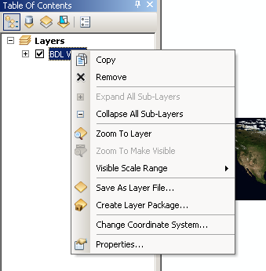
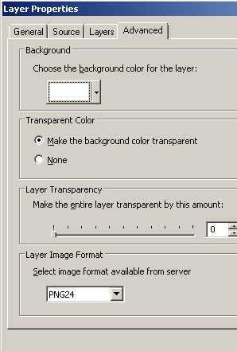
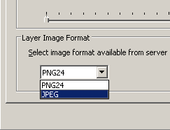
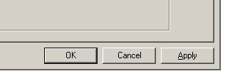

**Setting up ArcMap 10 to request JPEGs instead of PNGs**

ArcMap requests data from WMS using PNGs by default. PNGs are losslessly encoded and are generally the best option for requesting nice high quality images from a WMS. In some situations, like for example where the network connection to the WMS is fairly slow, using a lossy compressed format like JPEGs can reduce the size of the data that is transferred from the WMS, making things faster at the cost of slightly degraded imagery.

Here are instructions on how to switch from using PNGs to JPEGs in ESRI ArcMap 10.

-   Select the WMS layer you would like to change, right click it to bring up the menu, and select "Properties" to bring up the layer's properties dialog.
    
-   Next, select the "Advanced" tab, and look near the bottom of the dialog for the "Layer Image Format" selection box.
    
-   Change the "Layer Image Format" to "JPEG" instead of "PNG"
    
-   Finally, click the "Apply" button, followed by the "OK" button.
    

ArcMap should now be requesting JPEG images instead of PNGs.
